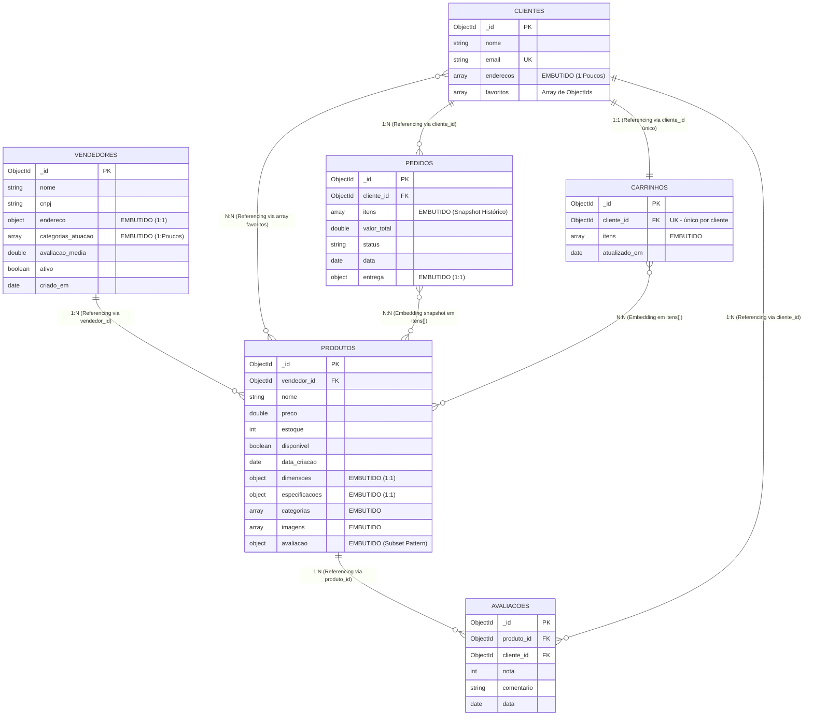

# Checkpoint 1 — PopsMarket
**Disciplina:** Banco de Dados NoSQL (TSI34E-TSI4) — UTFPR Campus Guarapuava
**Professor:** Prof. Marcelo Vichar
**Equipe:** Matheus Popolin · Sara Pereira de Almeida
**Data:** 10/09/2026

---

## 1. Tema e Escopo do Sistema

O **PopsMarket** é uma plataforma de **marketplace** que conecta múltiplos **vendedores** — que cadastram, precificam e gerenciam seus produtos — a **clientes finais**, que pesquisam produtos, consultam detalhes, montam um carrinho de compras e realizam pedidos. O sistema centraliza, em um único catálogo, a oferta de vendedores independentes de segmentos variados (eletrônicos, casa, moda, esportes), cada qual com seu próprio conjunto de atributos técnicos.

O problema real que o sistema resolve é a **heterogeneidade do catálogo** e a **alta frequência de leitura** típica de vitrines de e-commerce. Um notebook, um tênis e uma cadeira possuem especificações completamente diferentes; forçar todos esses itens em um esquema relacional rígido geraria tabelas esparsas, cheias de colunas nulas, ou uma explosão de tabelas de atributos (EAV) com JOINs custosos a cada renderização da vitrine.

O uso de **NoSQL orientado a documentos (MongoDB)** se justifica porque cada produto é armazenado como um documento **flexível e autocontido**: suas dimensões, especificações técnicas, categorias, imagens e resumo de avaliação vêm em uma única leitura, sem JOINs, refletindo diretamente o formato consumido pela tela do aplicativo (*Query-Driven Modeling*). Isso garante schema flexível por produto e tempo de resposta baixo nos fluxos de maior volume (vitrine, categoria e detalhe do produto).

---

## 2. Entidades e Coleções

O sistema é composto por **6 coleções**, integrando subdocumentos embutidos e arrays com controle de tipos BSON. As coleções `produtos`, `clientes`, `pedidos` e `carrinhos` contêm dados compostos (subdocumentos e/ou arrays).

### 2.1. Coleção `vendedores`
Representa os parceiros que anunciam produtos na plataforma.
* `_id`: ObjectId — Identificador único do vendedor.
* `nome`: String — Nome fantasia da loja.
* `cnpj`: String — Documento fiscal do vendedor.
* `endereco`: Subdocumento (Objeto):
  * `rua`: String
  * `numero`: Number
  * `cidade`: String
  * `cep`: String
* `categorias_atuacao`: Array de Strings — Segmentos em que o vendedor atua.
* `avaliacao_media`: Number (Double) — Reputação consolidada de 0.0 a 5.0.
* `ativo`: Boolean — Status de operação no marketplace.
* `criado_em`: Date — Data de cadastro.

### 2.2. Coleção `produtos` (entidade central)
Representa os anúncios de produtos disponíveis para venda.
* `_id`: ObjectId — Identificador único do produto.
* `vendedor_id`: ObjectId — **Referência** ao vendedor proprietário.
* `nome`: String — Nome do produto.
* `descricao`: String — Descrição comercial.
* `preco`: Number (Double) — Preço em Reais.
* `estoque`: Number (Int) — Quantidade disponível.
* `disponivel`: Boolean — Indica se está publicado/à venda.
* `data_criacao`: Date — Data de publicação do anúncio.
* `dimensoes`: Subdocumento (Objeto): `altura_cm`, `largura_cm`, `profundidade_cm`, `peso_kg` (Numbers).
* `especificacoes`: Subdocumento (Objeto) — Atributos técnicos variáveis por produto (ex: `processador`, `memoria_ram_gb`, `material`, `numeracao`).
* `categorias`: Array de Strings — Classificações do produto (indexação multikey).
* `imagens`: Array de Strings — Nomes/URLs das imagens.
* `avaliacao`: Subdocumento (Objeto) — **Subset Pattern**: `media` (Double) e `total` (Int) de avaliações.

### 2.3. Coleção `clientes`
Representa os consumidores cadastrados.
* `_id`: ObjectId — Identificador único do cliente.
* `nome`: String — Nome completo.
* `email`: String — E-mail de autenticação (**único**).
* `telefone`: String — Contato para entrega.
* `enderecos`: Array de Subdocumentos — Locais de entrega:
  * `rua`: String
  * `numero`: Number
  * `cidade`: String
  * `cep`: String
  * `principal`: Boolean — Endereço padrão.
* `favoritos`: Array de ObjectIds — **Referências** a `produtos` favoritados.

### 2.4. Coleção `pedidos`
Representa as compras concluídas.
* `_id`: ObjectId — Identificador único do pedido.
* `cliente_id`: ObjectId — **Referência** ao cliente solicitante.
* `itens`: Array de Subdocumentos (**Snapshot Histórico**):
  * `produto_id`: ObjectId — Referência ao produto comprado.
  * `nome`: String — Nome do produto no momento da compra.
  * `quantidade`: Number (Int) — Volume solicitado.
  * `preco_unitario`: Number (Double) — Preço praticado na transação.
* `valor_total`: Number (Double) — Somatório final.
* `status`: String — Fluxo (`"pendente"`, `"pago"`, `"enviado"`, `"entregue"`, `"cancelado"`).
* `data`: Date — Timestamp do pedido.
* `entrega`: Subdocumento (Objeto): `endereco` (String), `previsao` (String), `transportadora` (String).

### 2.5. Coleção `carrinhos`
Representa o carrinho de compras corrente de cada cliente.
* `_id`: ObjectId — Identificador único do carrinho.
* `cliente_id`: ObjectId — **Referência** ao cliente (**único**: 1 carrinho por cliente).
* `itens`: Array de Subdocumentos:
  * `produto_id`: ObjectId — Referência ao produto.
  * `nome`: String — Nome do produto.
  * `quantidade`: Number (Int).
  * `preco_unitario`: Number (Double).
* `atualizado_em`: Date — Última modificação do carrinho.

### 2.6. Coleção `avaliacoes`
Armazena as avaliações individuais dos produtos (dados completos). Complementa o **Subset Pattern**: o resumo (`media`/`total`) fica embutido em `produtos.avaliacao` para exibição rápida na vitrine, enquanto o histórico detalhado vive nesta coleção.
* `_id`: ObjectId — Identificador único da avaliação.
* `produto_id`: ObjectId — **Referência** ao produto avaliado.
* `cliente_id`: ObjectId — **Referência** ao cliente autor.
* `nota`: Number (Int) — Nota de 1 a 5.
* `comentario`: String — Texto da avaliação.
* `data`: Date — Data em que a avaliação foi registrada.

---

## 3. Modelagem: Embedding (Embutir) vs. Referencing (Referenciar)

| Relacionamento | Decisão Adotada | Justificativa Técnica & Trade-Offs |
| :--- | :---: | :--- |
| **Vendedor → Endereço** | **Embedding** *(Subdocumento)* | **Relação 1:1 estrita.** O endereço não existe nem é compartilhado de forma independente. Embutir traz o dado em uma única leitura, sem JOIN. |
| **Vendedor → Categorias de Atuação** | **Embedding** *(Array)* | **Lista curta e finita (1:Poucos).** Permite índice multikey (`{ categorias_atuacao: 1 }`) sem tabela de junção. |
| **Produto → Dimensões / Especificações** | **Embedding** *(Subdocumentos)* | **1:1 de tamanho previsível.** São dados sempre exibidos junto com o produto na tela de detalhe. Embutir garante leitura agregada e schema flexível por produto. |
| **Produto → Avaliação (resumo)** | **Embedding** *(Subset Pattern)* | Mantém apenas `media` e `total` no documento para exibição rápida na vitrine. As avaliações individuais (ilimitadas) ficam na coleção `avaliacoes`, evitando crescimento descontrolado e o limite de 16MB. |
| **Produto → Avaliações (detalhe)** | **Referencing** *(Coleção separada)* | **1:N potencialmente ilimitado.** Um produto pode acumular milhares de avaliações ao longo do tempo. Mantê-las em coleção própria (`avaliacoes` com `produto_id`) protege o documento do produto do limite de 16MB e permite paginação sob demanda. |
| **Produto → Vendedor** | **Referencing** *(ObjectId)* | **N:1 com ciclo de vida independente.** O vendedor tem centenas de produtos e é atualizado isoladamente. Referenciar evita duplicar e reprocessar os dados do vendedor em cada produto. |
| **Cliente → Endereços** | **Embedding** *(Array de Objetos)* | **1:Poucos acoplado.** Um cliente tem poucos endereços (Casa, Trabalho), todos necessários no checkout — leitura única do perfil. |
| **Cliente → Favoritos** | **Referencing** *(Array de ObjectIds)* | **N:N de volume moderado.** Produtos existem por si; salvar apenas o `_id` evita duplicar dados voláteis (preço, estoque) no cliente. |
| **Pedido → Itens** | **Embedding** *(Snapshot Histórico)* | **Imutabilidade e consistência fiscal.** O pedido congela nome e preço no momento da compra: alterações futuras no produto **não** podem mudar um pedido já fechado. Leitura atômica da comanda. |
| **Pedido → Cliente / Produto** | **Referencing** *(ObjectIds)* | **N:1 clássica.** Um cliente faz muitos pedidos; embutir seus dados geraria explosão de duplicação. |
| **Carrinho → Cliente** | **Referencing** *(ObjectId único)* | **1:1.** Cada cliente tem um único carrinho ativo, recuperado pelo `cliente_id`. |
| **Carrinho → Itens** | **Embedding** *(Array de Objetos)* | **Volume pequeno e escrita atômica.** O carrinho é lido e regravado por inteiro a cada alteração; embutir os itens é a opção mais performática. |

---

## 4. Relacionamentos e Cardinalidade



| Cardinalidade | Entidades | Estratégia |
| :---: | :--- | :--- |
| 1:1 | Cliente ↔ Carrinho | Referencing (`cliente_id` único) |
| 1:N | Vendedor → Produtos | Referencing (`vendedor_id`) |
| 1:N | Cliente → Pedidos | Referencing (`cliente_id`) |
| 1:N | Produto → Avaliações | Referencing (`produto_id`) |
| 1:N | Cliente → Avaliações | Referencing (`cliente_id`) |
| N:N | Cliente ↔ Produtos (favoritos) | Referencing (array de ObjectIds) |
| N:N | Pedido/Carrinho ↔ Produtos | Embedding em `itens[]` |

---

## 5. Exemplos de Documentos JSON

### 5.1. `vendedores`
```json
{
  "_id": { "$oid": "64a000000000000000000001" },
  "nome": "TechStore Guarapuava",
  "cnpj": "12.345.678/0001-90",
  "endereco": {
    "rua": "Rua XV de Novembro",
    "numero": 1200,
    "cidade": "Guarapuava",
    "cep": "85010-000"
  },
  "categorias_atuacao": ["Eletrônicos", "Informática"],
  "avaliacao_media": 4.8,
  "ativo": true,
  "criado_em": { "$date": "2025-01-15T10:00:00Z" }
}
```

### 5.2. `produtos`
```json
{
  "_id": { "$oid": "64b000000000000000000001" },
  "vendedor_id": { "$oid": "64a000000000000000000001" },
  "nome": "Notebook Lenovo IdeaPad 3",
  "descricao": "Notebook para estudos, trabalho e uso cotidiano.",
  "preco": 3499.90,
  "estoque": 25,
  "disponivel": true,
  "data_criacao": { "$date": "2026-08-01T14:30:00Z" },
  "dimensoes": { "altura_cm": 1.99, "largura_cm": 35.9, "profundidade_cm": 23.6, "peso_kg": 1.65 },
  "especificacoes": { "processador": "Intel Core i5", "memoria_ram_gb": 16, "armazenamento_gb": 512, "tipo_armazenamento": "SSD" },
  "categorias": ["Informática", "Notebooks", "Eletrônicos"],
  "imagens": ["notebook-frente.jpg", "notebook-lateral.jpg"],
  "avaliacao": { "media": 4.7, "total": 128 }
}
```

### 5.3. `clientes`
```json
{
  "_id": { "$oid": "64c000000000000000000001" },
  "nome": "Ana Silva",
  "email": "ana.silva@email.com",
  "telefone": "42999001001",
  "enderecos": [
    { "rua": "Rua Guaíra", "numero": 200, "cidade": "Guarapuava", "cep": "85015-000", "principal": true },
    { "rua": "Rua Ponta Grossa", "numero": 50, "cidade": "Guarapuava", "cep": "85015-100", "principal": false }
  ],
  "favoritos": [
    { "$oid": "64b000000000000000000001" },
    { "$oid": "64b000000000000000000003" }
  ]
}
```

### 5.4. `pedidos`
```json
{
  "_id": { "$oid": "64d000000000000000000001" },
  "cliente_id": { "$oid": "64c000000000000000000001" },
  "itens": [
    { "produto_id": { "$oid": "64b000000000000000000001" }, "nome": "Notebook Lenovo IdeaPad 3", "quantidade": 1, "preco_unitario": 3499.90 },
    { "produto_id": { "$oid": "64b000000000000000000003" }, "nome": "Fone de Ouvido Bluetooth JBL Tune 520", "quantidade": 1, "preco_unitario": 249.90 }
  ],
  "valor_total": 3749.80,
  "status": "entregue",
  "data": { "$date": "2026-08-20T19:30:00Z" },
  "entrega": { "endereco": "Rua Guaíra, 200 - Guarapuava", "previsao": "3 dias úteis", "transportadora": "Correios" }
}
```

### 5.5. `carrinhos`
```json
{
  "_id": { "$oid": "64e000000000000000000001" },
  "cliente_id": { "$oid": "64c000000000000000000001" },
  "itens": [
    { "produto_id": { "$oid": "64b000000000000000000002" }, "nome": "Smartphone Samsung Galaxy A54", "quantidade": 1, "preco_unitario": 1899.00 }
  ],
  "atualizado_em": { "$date": "2026-09-10T08:00:00Z" }
}
```

### 5.6. `avaliacoes`
```json
{
  "_id": { "$oid": "64f000000000000000000001" },
  "produto_id": { "$oid": "64b000000000000000000001" },
  "cliente_id": { "$oid": "64c000000000000000000001" },
  "nota": 5,
  "comentario": "Excelente custo-benefício, chegou rápido e bem embalado.",
  "data": { "$date": "2026-08-25T12:00:00Z" }
}
```

---

## 6. Relatórios e Indicadores de Negócio na Aplicação

| # | Relatório / Caso de Uso | Endpoint na API | Controller Responsável | Operadores & Padrão MongoDB |
| :-: | :--- | :--- | :--- | :--- |
| **1** | **Vitrine da Home (Melhor Avaliados)** | `GET /api/produtos/top` | `ProdutosController.listarTop` | Filtro `"avaliacao.media": { $gte: 4.0 }`, `.sort({ "avaliacao.media": -1 })`, `.limit(10)` e projeção econômica. |
| **2** | **Produtos por Categoria** | `GET /api/produtos?categoria=` | `ProdutosController.listarPorCategoria` | Filtro por array multikey `{ categorias: cat, disponivel: true }`, ordenado por preço. |
| **3** | **Detalhes do Produto + Vendedor** | `GET /api/produtos/:id` | `ProdutosController.detalhar` | Aggregation `$match` + `$lookup` em `vendedores` + `$unwind`. |
| **4** | **Carrinho do Cliente** | `GET /api/clientes/:id/carrinho` | `CarrinhoController.obter` | `findOne({ cliente_id })` + cálculo do total dos itens embutidos. |
| **5** | **Histórico de Pedidos** | `GET /api/clientes/:id/pedidos` | `PedidosController.listarPorCliente` | `find({ cliente_id }).sort({ data: -1 })` + total gasto agregado. |

---

### Detalhamento das Consultas nos Controllers

#### 1. Vitrine da Home (`GET /api/produtos/top`)
* **Arquivo:** `app/src/controllers/produtos.controller.ts`
```typescript
const col = getCollection("produtos");
const produtos = await col
  .find(
    { disponivel: true, "avaliacao.media": { $gte: 4.0 } },
    { projection: { nome: 1, preco: 1, avaliacao: 1, imagens: 1, categorias: 1 } }
  )
  .sort({ "avaliacao.media": -1 })
  .limit(10)
  .toArray();
```

#### 2. Produtos por Categoria (`GET /api/produtos?categoria=Eletrônicos`)
* **Arquivo:** `app/src/controllers/produtos.controller.ts`
```typescript
const filtro = { disponivel: true };
if (categoria) filtro.categorias = categoria;
const col = getCollection("produtos");
const produtos = await col.find(filtro).sort({ preco: 1 }).toArray();
```

#### 3. Detalhes do Produto + Vendedor (`GET /api/produtos/:id`)
* **Arquivo:** `app/src/controllers/produtos.controller.ts`
```typescript
const col = getCollection("produtos");
const resultado = await col.aggregate([
  { $match: { _id: new ObjectId(id) } },
  { $lookup: { from: "vendedores", localField: "vendedor_id", foreignField: "_id", as: "vendedor" } },
  { $unwind: { path: "$vendedor", preserveNullAndEmptyArrays: true } }
]).toArray();
```

#### 4. Carrinho do Cliente (`GET /api/clientes/:id/carrinho`)
* **Arquivo:** `app/src/controllers/carrinho.controller.ts`
```typescript
const col = getCollection("carrinhos");
const carrinho = await col.findOne({ cliente_id: new ObjectId(id) });
const total = carrinho.itens.reduce((acc, i) => acc + i.preco_unitario * i.quantidade, 0);
```

#### 5. Histórico de Pedidos (`GET /api/clientes/:id/pedidos`)
* **Arquivo:** `app/src/controllers/pedidos.controller.ts`
```typescript
const col = getCollection("pedidos");
const pedidos = await col
  .find({ cliente_id: new ObjectId(id) })
  .sort({ data: -1 })
  .toArray();
```
